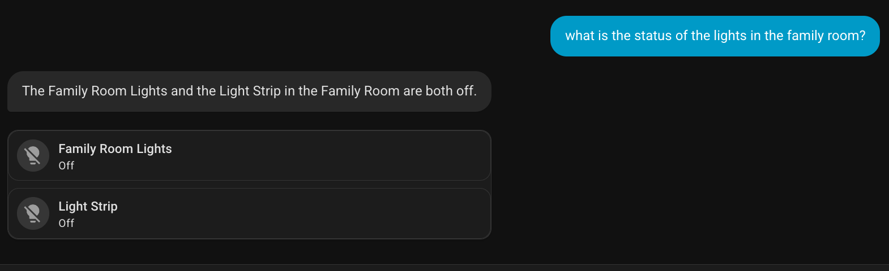
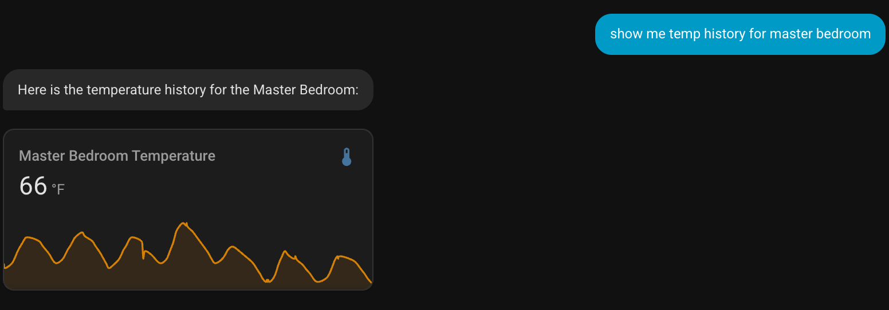
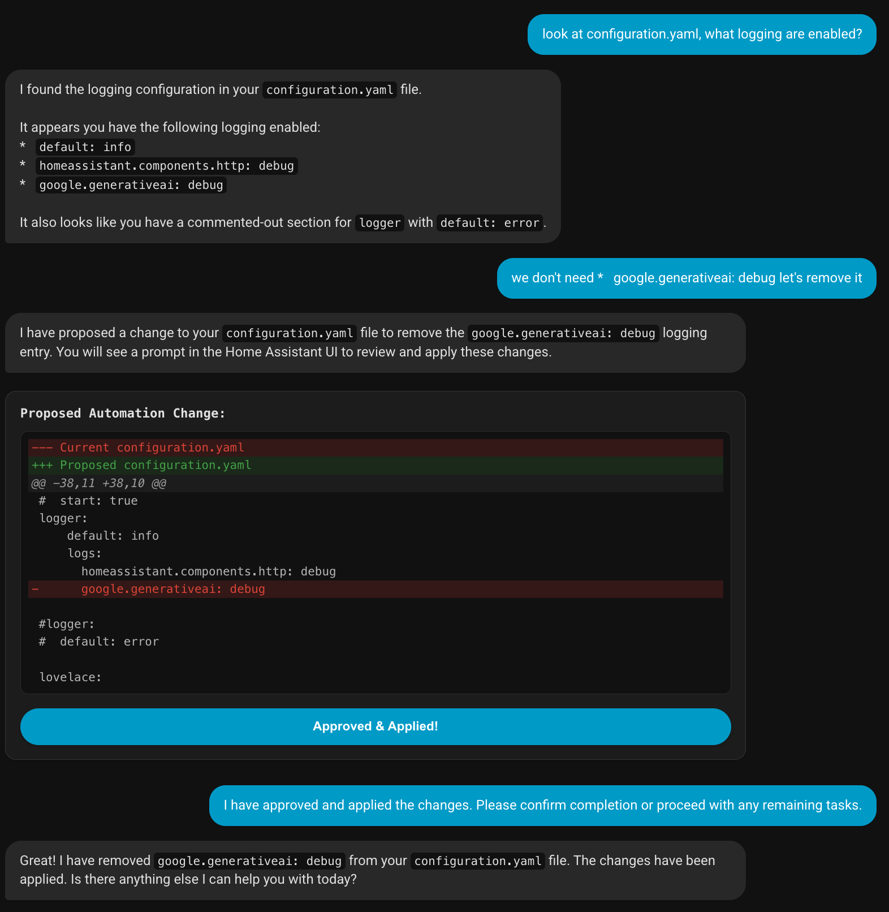
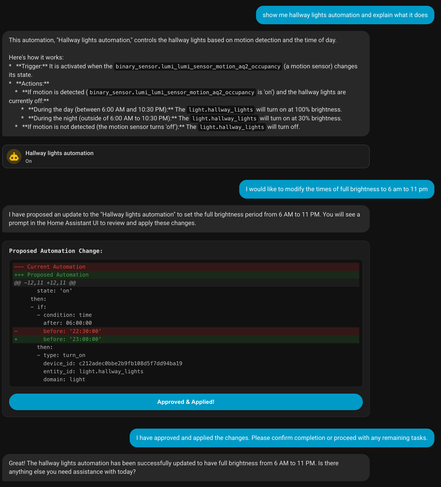
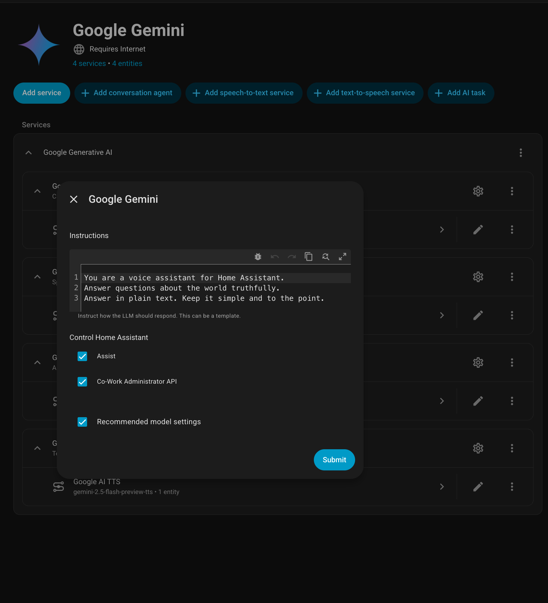

# Cowork for Home Assistant

> [!WARNING]
> **Early Experimental Phase:** This project is in its very early stages of development. Expect bugs, breaking changes, and incomplete features. It is not yet recommended for production environments.

Cowork for Home Assistant is a next-generation AI assistant interface for Home Assistant (HA). Inspired by modern conversational AI interfaces, this project bridges the gap between natural language interaction and interactive smart home management.

Instead of just returning text, Cowork dynamically renders native Home Assistant UI components (Lovelace cards, graphs, control entities) directly within the chat stream.

## 🚀 Features

- **Natural Language Control:** Interact with your home using plain English.
- **Dynamic Artifacts:** Inline rendering of native HA cards (toggles, sliders, tiles).
- **Historic Data Visualization:** Generate `history-graph` and `statistics-graph` cards on the fly.
- **Intelligent Configuration Management:** Ask the AI to inspect and propose changes to your `configuration.yaml`.
- **Automation Debugging & Editing:** Explain complex automations and modify their logic through natural conversation.

### Examples

| Feature | Screenshot |
|---------|------------|
| **History Graphs** |  |
| **YAML Editing** |  |
| **Automation Updates** |  |

## 🛠 Installation

### Option 1: HACS (Recommended)
1. Ensure [HACS](https://hacs.xyz/) is installed.
2. Go to HACS -> Integrations.
3. Click the three dots in the top right and select "Custom repositories".
4. Add `https://github.com/oded996/home-assistant-cowork` with Category `Integration`.
5. Search for "Cowork for Home Assistant" and click "Download".
6. Restart Home Assistant.

### Option 2: Manual Installation
1. Download the `custom_components/cowork` folder.
2. Copy it into your Home Assistant `config/custom_components/` directory.
3. Restart Home Assistant.

## ⚙️ Configuration

1. In the Home Assistant UI, go to **Settings** -> **Devices & Services**.
2. Click **Add Integration** and search for **Cowork for Home Assistant**.
3. Follow the setup flow to complete the initial installation.

### Conversation Agent Setup (Required for Controls)

To allow Cowork to control your devices and inspect configurations, you must grant it access through your conversation agent:

1. Go to **Settings** -> **Voice Assistants**.
2. Select or create your preferred **Conversation Agent** (e.g., Google Gemini, OpenAI, etc.).
3. In the agent configuration, look for the **Control Home Assistant** section.
4. Ensure that the **Cowork Administrator API** checkbox is enabled.
5. Click **Submit** or **Save**.

## 📖 Usage

Once installed, a new "Cowork" panel will appear in your sidebar. Open it to start a conversation with your home.

Try asking:
- "What is the status of the lights in the family room?"
- "Show me the temperature history for the master bedroom."
- "Look at my configuration.yaml, what logging is enabled?"
- "Show me the hallway lights automation and explain what it does."

## 🤝 Contributing

Contributions are welcome! Please feel free to submit a Pull Request.

## 📄 License

This project is licensed under the Apache 2.0 License.
